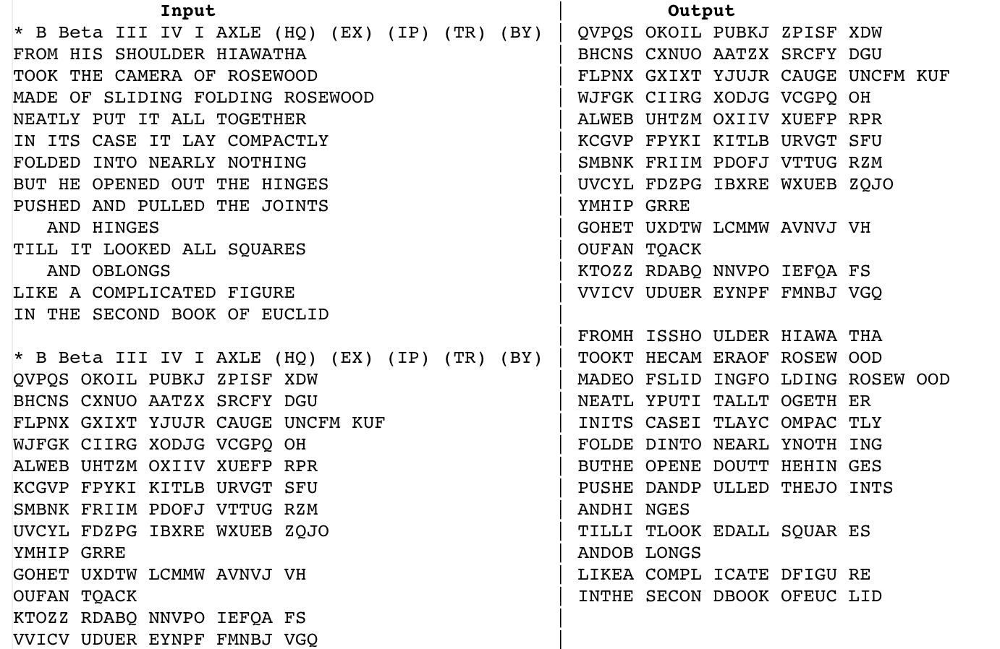

# JavaProjects

This repo is an advertisement for three projects I completed as a part of CS 61B (Data Structures) at UC Berkeley in Spring 2020. Due to course policy, I cannot publicly post the code, but it is available upon request.

All projects below were sophisticated Java programs consisting of around 1000 lines of code each, with many subclasses. The data structures used ran the gamut of those commonly used in software engineering, from linked lists to hash tables to search trees.

## Enigma

[Project spec](https://inst.eecs.berkeley.edu/~cs61b/sp20/materials/proj/proj1/index.html)

[The actual Enigma (source: Wikipedia).](enigmaWikipedia.png)

In this project, I built a version of the German Enigma machine from WWII. The machine was fully customizable; one could specify the alphabet, the number of rotors used, the exact mapping of each rotor, number of pawls, and other elements of the machine. It was fully configurable, and one of our tests was to reproduce the NAVALI cipher (used by the German Navy).

 

## Lines of Action

[Project spec](https://inst.eecs.berkeley.edu/~cs61b/sp20/materials/proj/proj2/index.html)

In this project, I built a board game app that plays [Lines of Action](https://en.wikipedia.org/wiki/Lines_of_Action), a game similar to Go but played on a Checkers board. Like Go, it has a remarkably deep strategy despite following relatively simple rules. For the first part of the project, I implemented a playable version of the game, both via the command line and also with a GUI. For the second part of the project, I implemented an AI that could play the game (and was able to beat me -- though I admit I am not particularly adept at Lines of Action). The AI player worked using [game trees](https://en.wikipedia.org/wiki/Game_tree); as naively trees grow exponentially with depth, to allow for more sophisticated search, I also implemented [alpha-beta pruning](https://en.wikipedia.org/wiki/Alpha%E2%80%93beta_pruning) on the trees.

## Git-let

[Project spec](https://inst.eecs.berkeley.edu/~cs61b/sp20/materials/proj/proj3/index.html)

In this project, I built a working version of Git from scratch. We had to design the application entirely ourselves, with no starter code, and the finished product had to reproduce much of the functionality of Git, including the commands add, rm, branch, commit, merge, log, checkout, status, etc. I also implemented the remote commands add-remote, pull, and fetch, useful for remote repositories (like on Github!). Like in real Git, copies of files were stored in a .gitlet directory with the SHA-1 cryptographic hash of their contents ("blobs") as the file IDs, and each commit kept a table mapping filenames to blobs.
